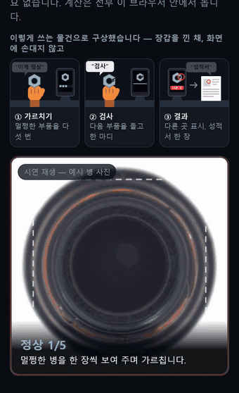
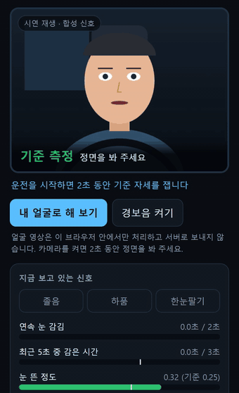
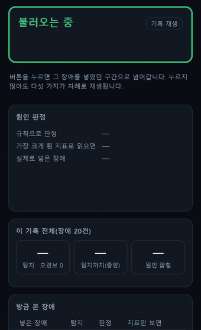
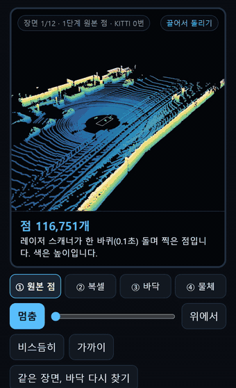

# 지민종 · AI 엔지니어

의료기기 연구원(임베디드 C · ISO 13485)으로 일하다 AI로 넘어왔습니다.
모델을 만드는 것만큼, **그 결과가 맞는지 재는 일**에 시간을 씁니다.

## 눌러 볼 수 있는 것 — [mjholics.github.io](https://mjholics.github.io/)

설치도 로그인도 없습니다. 계산은 서버가 아니라 보는 사람의 브라우저에서 돕니다. 휴대폰에서도 열립니다.

| | |
|---|---|
|  |  |
| **[찍어서 가르치는 검사기](https://mjholics.github.io/vlm-defect-inspector/)** · [코드](https://github.com/MJHolics/vlm-defect-inspector) 멀쩡한 것 5장만 보여 주면 다음 물건에서 다른 곳을 짚고 검사 성적서를 만듭니다. 처음 보는 물건 10종에서 맞게 짚은 비율 0.80 · 0.87. | **[졸음 감지](https://mjholics.github.io/dms-agent/)** · [코드](https://github.com/MJHolics/dms-agent) 눈을 2초 감으면 경보. 신호 하나만 볼 때 놓친 경보 60% → 합쳐 판단해 0.4%. 파이썬 원본과 브라우저 판단 4,228프레임 일치. |
|  |  |
| **[AI 서버 관제탑](https://mjholics.github.io/llm-serving-rca/)** · [코드](https://github.com/MJHolics/llm-serving-rca) 실제 LLM 서버에 장애 다섯 가지를 넣어 잰 41분 기록 위에서 탐지와 원인 판정을 다시 계산합니다. 장애 20건 탐지 20/20, 원인 판정 0.80 → 1.00. | **[돌려 보는 라이다](https://mjholics.github.io/lidar-edge-accel/)** · [코드](https://github.com/MJHolics/lidar-edge-accel) 도로에서 찍은 12만 점을 손으로 돌립니다. C++ 코드가 브라우저에서 돌고, 같은 계산의 CUDA판은 5.55 → 0.70ms. |

## 수치로 남긴 것

| 프로젝트 | 잰 것 |
|---|---|
| [vlm-defect-inspector](https://github.com/MJHolics/vlm-defect-inspector) | 금속 결함 판정, 학습 없이 33.7% → 미세조정과 교정 루프 뒤 98.9%. 더 높은 99.3% 후보는 검증 기준에 걸려 버림 |
| [inspection-copilot](https://github.com/MJHolics/inspection-copilot) | 검사 질의를 비전·문서 검색·DB로 나눠 보내는 에이전트. 규칙 라우터 0.80 대 로컬 7B 모델 0.975 |
| [vllm-serving-bench](https://github.com/MJHolics/vllm-serving-bench) · [triton-inference-bench](https://github.com/MJHolics/triton-inference-bench) | vLLM 6,284 tok/s. Triton을 얹으면 동시 16 이하에서는 이득, 32 이상에서는 최대 38.7% 손해 |
| [vla-edge-policy](https://github.com/MJHolics/vla-edge-policy) | 로봇 제어 모델의 성공률과 지연 맞바꿈(p=0.018), 지연이 두 봉우리로 갈리는 원인을 GPU 커널 제출 경로까지 추적 |
| [autonomous-cv-pipeline](https://github.com/MJHolics/autonomous-cv-pipeline) | 검출 mAP 0.43 → 0.68, 분할 mIoU 0.107 → 0.586, TensorRT 132 → 316FPS |
| [multimodal-rag](https://github.com/MJHolics/multimodal-rag) | 기술 문서 검색, 정답 문서를 모두 찾은 비율 0.627 → 0.731. 벡터 DB 두 종을 같은 조건에서 비교 |
| [demand-forecasting-gbm](https://github.com/MJHolics/demand-forecasting-gbm) | 합성 데이터에서 이긴 모델이 실제 데이터에서는 단순 기준선에 짐(7.20 대 3.27) → 원인을 찾아 40% 줄임 |
| [predictive_maintenance](https://github.com/MJHolics/predictive_maintenance) | 교과서대로 쓴 드리프트 경보가 변화 없는 데이터에서 94% 오경보 → 보정 뒤 4% |

각 저장소 README에 왜 그 방법을 골랐는지, 무엇을 바꿨는지, 어디서 막혔는지를 같이 적었습니다.

wlalswhd369@naver.com
